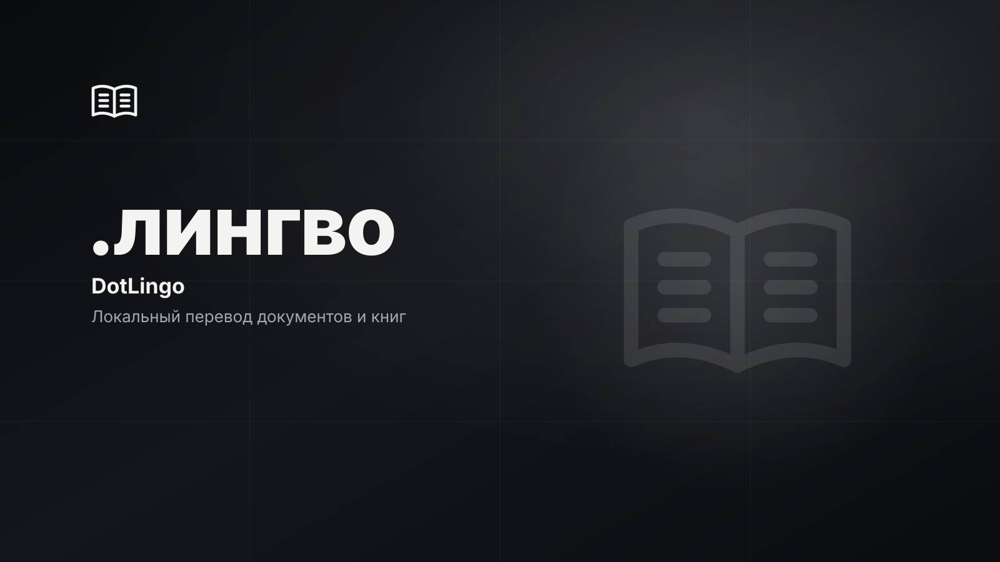

# DotLingo

<p>
  
  
  
  <!-- loc:start --><!-- loc:end -->
</p>



DotLingo - настольное приложение для локального перевода документов. Оригиналы, очередь и результаты хранятся отдельно; inference работает через локальный GGUF runtime. Интерфейс - pywebview (Edge WebView2) с веб-слоем без сборки: стеклянный монохромный дизайн, светлая и тёмная темы.

## Что внутри

- **Автонастройка устройства:** фоновая проверка RAM, диска, CPU, NVIDIA GPU и runtime при каждом запуске. Модель подбирается по расчётным требованиям памяти и месту на диске; оценка не ранжирует качество перевода.
- **Выбор модели:** закреплённые Qwen3 модели доступны для загрузки после явного согласия, с проверкой SHA-256 и ревизии. Свои GGUF импортируются одной формой: копия в хранилище, проверка размера и хэша.
- **Проекты и очередь:** несколько целевых языков, пауза, отмена и восстановление прерванных задач; очередь группируется по проектам с фильтрами. Проекты можно переименовывать и удалять.
- **Редактор:** оригинал рядом с переводом, поиск по документу, ручная правка с защитой несохранённых изменений и экспорт по матрице форматов.
- **Глоссарий:** термины проекта с инлайн-редактированием и удалением; совпадения защищаются внутри каждого фрагмента.
- **Форматы:** импорт TXT, Markdown, DOCX, EPUB и PDF с текстовым слоем. Экспорт TXT, Markdown, DOCX и EPUB; OCR и PDF writer отсутствуют.
- **Мастер первого запуска:** проверка устройства, рекомендация модели, скачивание с согласием по лицензии - один проход.

Подробности: [локальная установка](docs/LOCAL_SETUP.md), [модели](docs/MODEL_MATRIX.md), [архитектура](docs/ARCHITECTURE.md), [форматы](docs/FORMAT_MATRIX.md), [сборка Windows](docs/BUILD_WINDOWS.md).

## Запуск

Нужен CPython 3.12 или 3.13 и Microsoft Edge WebView2 (на Windows 11 и обновлённой Windows 10 уже установлен; иначе - [Evergreen-установщик](https://developer.microsoft.com/microsoft-edge/webview2/)). В PowerShell из корня репозитория:

```powershell
python -m venv .venv
.\.venv\Scripts\Activate.ps1
python -m pip install -e ".[dev,pdf]"
python -m dotlingo
```

Для перевода нужен отдельный `llama-cpp-python` runtime. Встроенные веса не скачиваются автоматически. Пользовательский GGUF импортируется только после выбора файла и подтверждения копирования.

## Команды

| Действие | Команда |
|----------|---------|
| Запустить приложение | `python -m dotlingo` |
| Headless-проверка моста | `python -m dotlingo --smoke-test` |
| Запустить тесты | `python -m pytest -q` |
| Проверить стиль | `python -m ruff check src tests` |
| Собрать Windows Setup.exe | `.\deploy\windows\build.ps1` |

## Стек

<p>
  
  
  
  
  
  
  
  
  
</p>

## Проверки

Тесты покрывают форматы, сегментацию, очередь, сохранение состояния, загрузку моделей, мост pywebview и headless smoke-режим. Для PDF fixture нужен PyMuPDF (`fitz`). Setup.exe и чистая Windows установка ещё не проверены.

## Архитектура

pywebview открывает окно WebView2 и раздаёт локальный веб-слой через встроенный HTTP-сервер (ES-модули не работают с `file://`). Python-мост `api.py` вызывает UI-независимое ядро; события очереди и прогресс загрузки пушатся в JS через `evaluate_js`. SQLite хранит очередь и переводы, а изолированный worker запускает локальную GGUF модель через llama.cpp.

```text
src/dotlingo/
├── app.py                 # окно pywebview, HTTP-раздача, graceful close
├── api.py                 # мост js_api: конверт, worker-потоки, push-события
├── web/                   # веб-слой без сборки
│   ├── index.html
│   ├── styles/            # токены тем, компоненты, страницы
│   └── js/                # bridge, store, router, компоненты, 7 страниц + мастер
├── hardware.py            # проверка ресурсов и оценка подходящей модели
├── models.py              # закреплённый и пользовательский каталоги GGUF
├── model_download.py      # загрузка с проверкой согласия и SHA-256
├── task_queue.py          # очередь и управление inference
├── engine.py              # изолированный inference worker
├── storage.py             # проекты, переводы и очередь SQLite
├── formats.py             # импортеры и экспортёры документов
├── segmentation.py        # сегменты текста
└── glossary.py            # защита терминов
```

- Модель рекомендуется по расчётной RAM с резервом и доступному месту; качество языковых пар не измеряется.
- CPU потоки настраиваются автоматически с пределом 8 и одним оставленным логическим потоком. GPU offload сейчас выключен.
- Мост возвращает единый конверт `{ok, data}`; долгие операции уходят в worker-потоки, отмены сохранены (после фазы активации отмена загрузки недоступна).
- Оригиналы неизменяемы; переводы и экспорты разделены по целевым языкам.
- Темы интерфейса - CSS-переменные `[data-theme]`; переключение сохраняется в preferences.

## Лицензия

© 2026 DotCore. Все права защищены.

Проприетарный код. Использование, копирование, изменение и распространение запрещены без письменного разрешения автора. Исходный код открыт только для ознакомления. См. [LICENSE](LICENSE).
